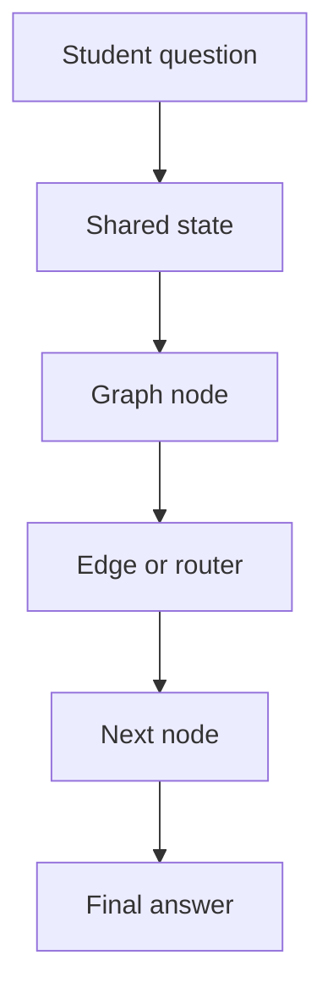
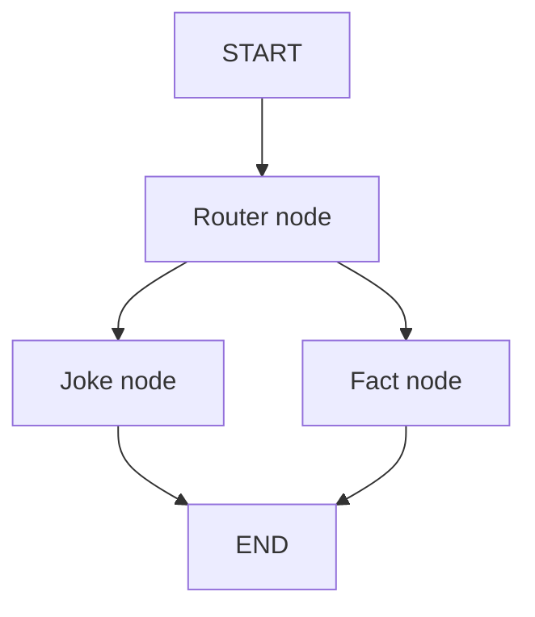
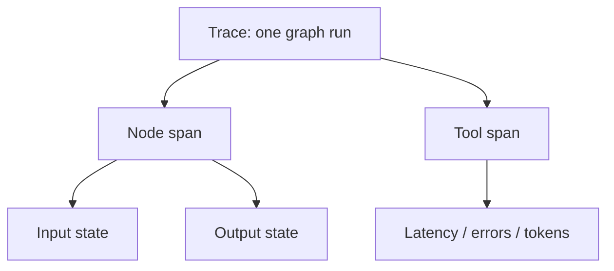
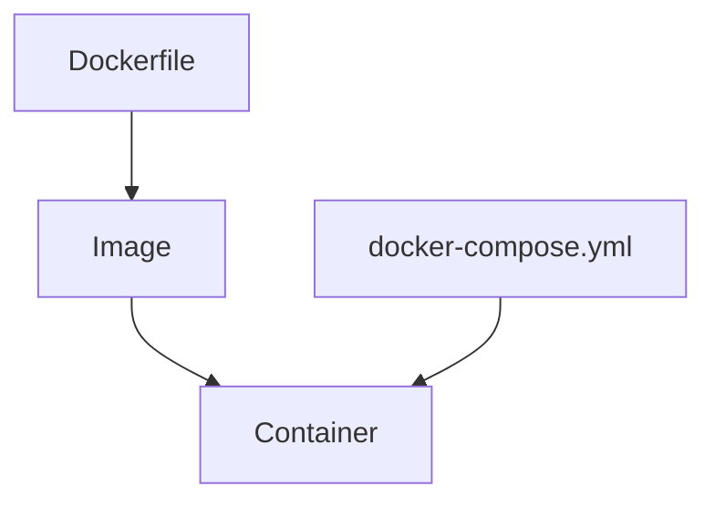
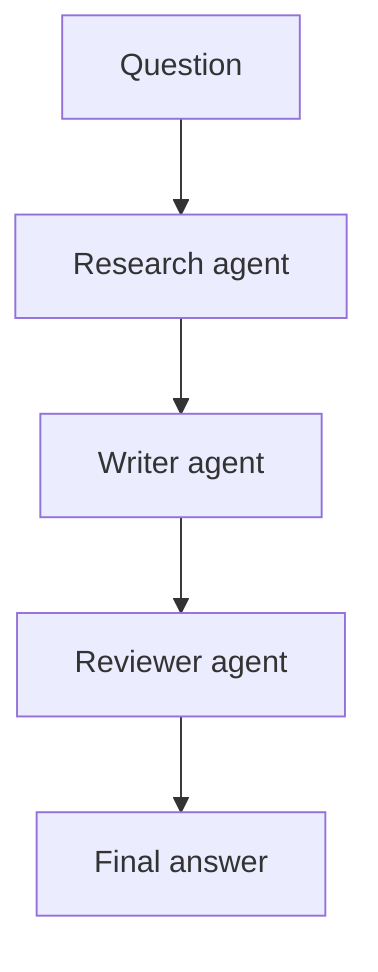

# LangGraph Learning Lab

Learn LangGraph and LangSmith by building small AI workflows in Docker.

This repo is designed as a teaching lab. The student should leave understanding what a graph is, why state matters,
how nodes and edges work, how routing changes execution, how tools and memory fit into agents, and how LangSmith helps
debug the whole thing.

Everything runs with Docker Compose. No local Python setup is required.



## What This Project Is

This is a beginner-friendly LangGraph bootcamp repo.

If you are learning from the repo, start with `modules/`. Each module is a small lab you can run and inspect.
Instructor-only material lives deeper in `docs/instructor/` so the first view stays focused on the labs.

It is not trying to be a complex production agent. It is intentionally small so you can teach every line:

- what the state contains
- what each node reads
- what each node returns
- why an edge goes to the next node
- why a router chooses one branch
- where a tool is called
- where memory is stored
- what LangSmith shows during execution

## What Is LangGraph?

LangGraph is a framework for building stateful AI workflows as graphs.

A simple chain is usually:

```text
Step A -> Step B -> Step C
```

That is fine when the workflow is always linear.

LangGraph is useful when the workflow needs:

- shared state
- branching
- loops
- memory
- tool calls
- human review
- multiple agents
- persistence
- observability

In LangGraph, the big ideas are:

| Concept | Meaning |
|---|---|
| State | The data object passed through the workflow. |
| Node | A function that does one piece of work. |
| Edge | A connection from one node to another. |
| Conditional edge | A router that chooses the next node. |
| Graph | The full workflow made from nodes and edges. |

Mental model:



## What Is LangSmith?

LangSmith is the observability and debugging layer.

When a graph runs, LangSmith helps you see:

- the full graph trace
- each node execution
- each tool call
- inputs and outputs
- errors
- latency
- token usage when models are used

Plain English:

```text
LangGraph runs the workflow.
LangSmith shows what happened inside the workflow.
```



Use [docs/instructor/langsmith-deep-dive.md](docs/instructor/langsmith-deep-dive.md) when teaching LangSmith.

## Important Commands

Use the short lab launcher instead of typing long Docker Compose commands.

On macOS, Linux, or Git Bash:

```bash
./lab module 1
./lab 1
./lab capstone
./lab test
```

On Windows without changing PowerShell execution policy:

```powershell
.\lab.cmd module 1
.\lab.cmd 1
.\lab.cmd capstone
.\lab.cmd test
```

If your PowerShell policy allows scripts:

```powershell
.\lab.ps1 module 1
.\lab.ps1 1
.\lab.ps1 capstone
.\lab.ps1 test
```

List all modules:

```bash
./lab list
```

Windows:

```powershell
.\lab.cmd list
```

Build the Docker image:

```bash
./lab build
```

Run the test suite:

```bash
./lab test
```

Run the first lesson:

```bash
./lab module 1
```

Run any lesson:

```bash
./lab module 3
```

Run the capstone:

```bash
./lab capstone
```

Run Ruff:

```bash
./lab ruff
```

Run MyPy:

```bash
./lab mypy
```

Open the Compose config:

```bash
docker compose config
```

Stop and clean up Compose containers:

```bash
./lab down
```

## Slide Deck

This repo includes a 30-slide HTML teaching deck in
[docs/instructor/slides/index.html](docs/instructor/slides/index.html).

Open it directly in a browser, or deploy the repository to Vercel. The [vercel.json](vercel.json) file rewrites `/` to
the slide deck.

GitHub repo:

```text
https://github.com/kaiiiio/AI-collective-langgraph
```

## LangSmith Setup

The repo runs without LangSmith credentials.

To teach tracing:

1. Create a LangSmith account.
2. Copy `.env.example` to `.env`.
3. Add your API key.
4. Turn tracing on.

`.env`:

```text
LANGSMITH_TRACING=true
LANGSMITH_API_KEY=your_key_here
LANGSMITH_PROJECT=langgraph-learning-lab
```

Then run:

```bash
./lab module 9
```

In class, explain that students should look for:

- the project
- the trace list
- one graph run
- node inputs
- node outputs
- timing
- errors if any

## How The Repo Works

The repo has three layers.

### 1. Lessons

`modules/` contains the teaching modules.

Each module has:

- `Concept.md`: explanation
- `Code.md`: command and code idea
- `Example.md`: expected flow
- `Exercise.md`: beginner, intermediate, challenge
- `Solution.md`: reference answer
- `main.py`: runnable demo
- `solution.py`: runnable solution

### 2. Application Code

`app/` contains reusable code:

| Folder | Purpose |
|---|---|
| `app/graphs/` | Graph functions and LangGraph builders. |
| `app/state/` | Typed state definitions. |
| `app/tools/` | Equation solver, text analyzer, source triage helper. |
| `app/services/` | Memory helper. |
| `app/agents/` | Research, writer, reviewer agents. |
| `app/config/` | LangSmith and app settings. |

### 3. Tests

`tests/` verifies the core teaching examples:

- graph behavior
- routing behavior
- tool behavior
- memory behavior
- capstone behavior

### 4. Instructor Material

`docs/instructor/` contains the teaching deck, speaker notes, Docker explanations, LangSmith deep dive, and longer
lesson notes. Students do not need these files to start the lab.

## Teaching Flow

Use this as a 60-minute workshop.

| Time | Topic | What to show |
|---:|---|---|
| 0-5 min | AI agents overview | Explain why linear chains are limited. |
| 5-15 min | LangGraph basics | Run module 1 and draw START -> NODE -> END. |
| 15-25 min | State, nodes, edges | Run modules 2 and 3. Show state before and after. |
| 25-35 min | Tools and memory | Run modules 4 and 5. Explain deterministic tools. |
| 35-45 min | Agent and multi-agent | Run modules 6 and 7. Show role-based nodes. |
| 45-55 min | LangSmith | Run module 9 with tracing enabled. Inspect traces. |
| 55-60 min | Capstone | Run module 10 and connect all ideas. |

## How To Teach Each Module

Use the same pattern every time:

1. Open `Concept.md`.
2. Draw the Mermaid diagram.
3. Ask: what is the state?
4. Open `main.py`.
5. Identify the node functions.
6. Identify the edge or routing decision.
7. Run the command.
8. Read the output.
9. Ask what changed in state.
10. Give the beginner exercise.

The most important teaching question:

```text
What did this node receive, and what did it return?
```

If students understand that, they understand LangGraph.

For a module-by-module instructor explanation, including whether each lesson is inductive, use
[docs/instructor/module-by-module-teaching-guide.md](docs/instructor/module-by-module-teaching-guide.md).

## Module Guide

| Module | Topic | Command | Inductive? |
|---|---|---|---|
| `01_hello_graph` | Graph, node, edge, execution flow | `./lab module 1` | Yes |
| `02_state_management` | Typed state before and after execution | `./lab module 2` | Yes |
| `03_conditional_edges` | Routing to joke or fact branch | `./lab module 3` | Yes |
| `04_tools` | Equation solver, text analyzer, source triage | `./lab module 4` | Yes |
| `05_memory` | Conversation memory | `./lab module 5` | Yes |
| `06_agent` | Tool selection and answer flow | `./lab module 6` | Partly |
| `07_multi_agent` | Research, writer, reviewer agents | `./lab module 7` | Partly |
| `08_human_review` | Approval before publish | `./lab module 8` | Yes |
| `09_langsmith` | Tracing and observability | `./lab module 9` | Partly |
| `10_capstone_project` | AI research assistant | `./lab capstone` | Partly |

## Docker Mental Model

Docker keeps the class environment consistent.

Without Docker:

```text
Works on my machine.
Fails on yours.
```

With Docker:

```text
Same Python version.
Same dependencies.
Same commands.
Same result.
```



Use these files when teaching Docker:

- [docs/instructor/docker/README.md](docs/instructor/docker/README.md)
- [docs/instructor/docker/Dockerfile-line-by-line.md](docs/instructor/docker/Dockerfile-line-by-line.md)
- [docs/instructor/docker/compose-line-by-line.md](docs/instructor/docker/compose-line-by-line.md)

## Capstone Story

The capstone is an AI Research Assistant.

It shows the full architecture:



When teaching it, do not oversell it as a finished product. Teach it as the smallest complete example of a production
pattern:

- one state object
- multiple role-specific nodes
- deterministic review
- testable output
- Docker runtime
- LangSmith-ready execution

## Comparison Table

| Tool | Best for | How it differs from LangGraph |
|---|---|---|
| LangChain | LLM components and chains | LangGraph focuses on explicit stateful workflows. |
| CrewAI | Role-based agent teams | LangGraph gives more control over state and routing. |
| AutoGen | Conversational multi-agent systems | LangGraph makes the workflow graph explicit. |
| OpenAI Agents SDK | OpenAI-native agent execution | LangGraph is graph-first and model-provider flexible. |

## Instructor Checklist

Before class:

- Run `./lab build`.
- Run `./lab test`.
- Run `./lab capstone`.
- If teaching LangSmith, create `.env` and test module 9.
- Open `docs/instructor/60-minute-teaching-plan.md`.
- Open `docs/instructor/speaker-notes.md`.

During class:

- Keep returning to state, nodes, and edges.
- Draw the graph before running code.
- Ask students to predict the next node.
- Use LangSmith only after they understand the graph.
- End with the capstone as composition, not magic.
