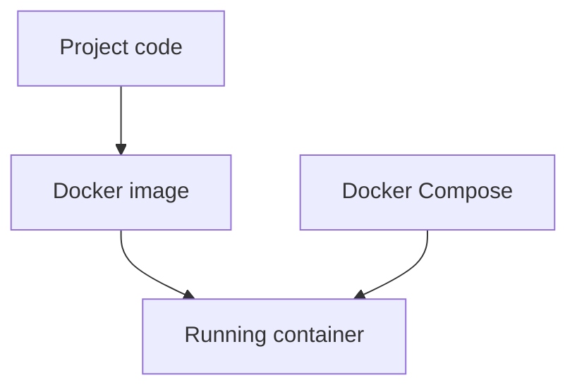

# Docker Learning Module

## What is Docker?

Without Docker:

```text
Works on my machine
Fails on yours
```

With Docker:

```text
Same environment everywhere
```



## Image

An image is the recipe plus packaged filesystem for the application.

## Container

A container is a running instance of an image.

## Dockerfile

The Dockerfile says how to build the image. In this lab it starts with `python:3.12-slim`, installs
dependencies, copies the project, and runs a module.

## Docker Compose

Compose runs one or more services with shared configuration. Here it runs the `lab` service with `.env` values.

## Why AI Engineers Use Docker

AI apps often depend on exact Python versions, model SDKs, API keys, and system libraries. Docker makes the
environment reproducible for students, teammates, and deployment.
