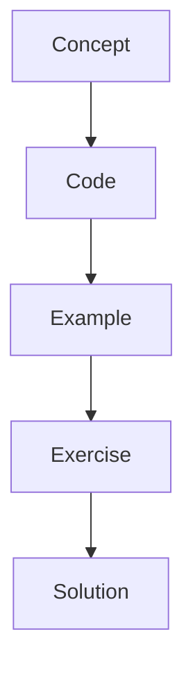

# What Is State?

State is the shared typed data object passed between graph nodes. Each node reads part of the state and returns updates.

## Instructor Notes

Start with the mental model, draw the graph, run the smallest possible example, then ask students to change
one thing. The repetition is intentional: concept, code, example, exercise, solution.
