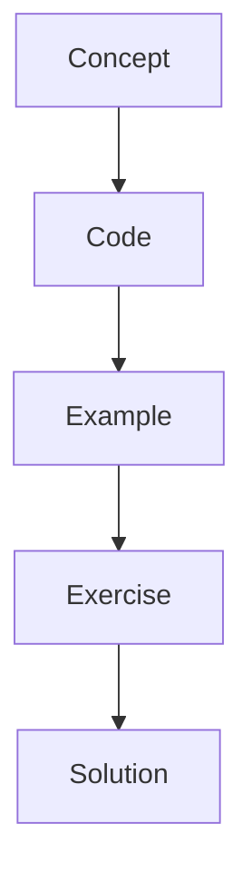

# Human In The Loop

Human review is an enterprise pattern where automation pauses for approval, correction, or escalation.

## Instructor Notes

Start with the mental model, draw the graph, run the smallest possible example, then ask students to change
one thing. The repetition is intentional: concept, code, example, exercise, solution.
