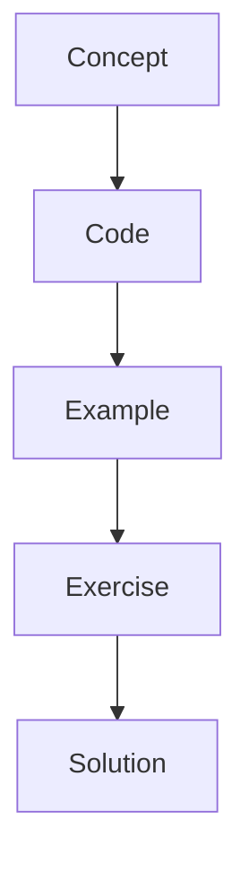

# LangSmith

LangSmith provides traces, spans, metrics, debugging, evaluation, and visibility into graph execution.

## Instructor Notes

Start with the mental model, draw the graph, run the smallest possible example, then ask students to change
one thing. The repetition is intentional: concept, code, example, exercise, solution.

Continue with [langsmith-deep-dive.md](../langsmith-deep-dive.md) and the screenshot placeholders in
[langsmith-screenshots/README.md](../langsmith-screenshots/README.md).
