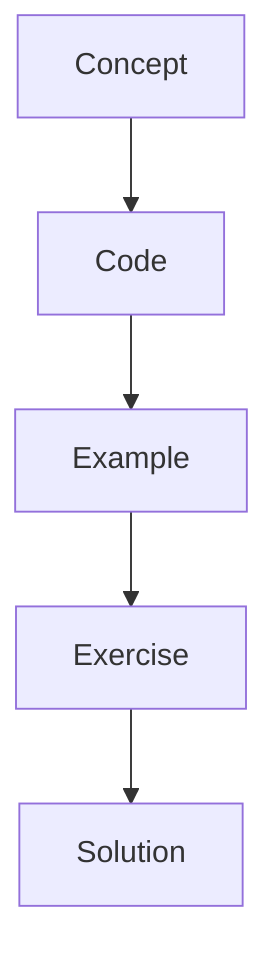

# Docker

Docker packages the runtime so students can run the same environment everywhere.

## Instructor Notes

Start with the mental model, draw the graph, run the smallest possible example, then ask students to change
one thing. The repetition is intentional: concept, code, example, exercise, solution.

Then open [../docker/Dockerfile-line-by-line.md](../docker/Dockerfile-line-by-line.md) and
[../docker/compose-line-by-line.md](../docker/compose-line-by-line.md) to explain the container setup line by line.
