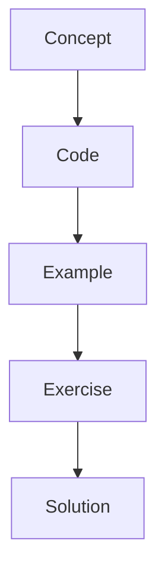

# Production Patterns

Production agent systems need typed state, configuration, tests, tracing, retries, and clean boundaries.

## Instructor Notes

Start with the mental model, draw the graph, run the smallest possible example, then ask students to change
one thing. The repetition is intentional: concept, code, example, exercise, solution.
