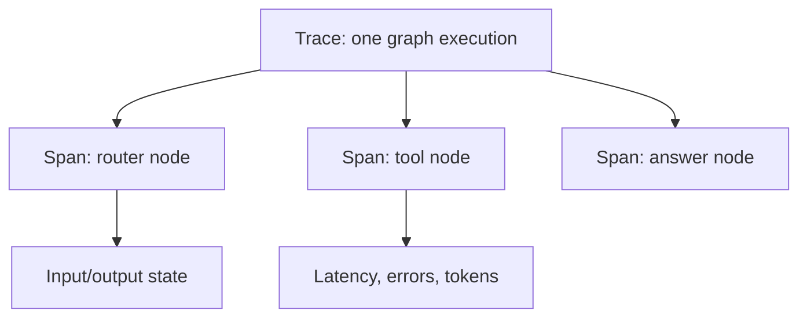

# LangSmith Deep Dive

LangSmith is the observability layer for the lab. It answers the questions you ask when an agent behaves strangely:

- What ran?
- Which node ran first?
- What state entered the node?
- What state came out?
- Which tool was called?
- How long did the run take?
- How many tokens did the model use?



## Vocabulary

| Term | Meaning |
|---|---|
| Trace | The full graph execution from start to finish. |
| Run | One recorded operation, such as a graph, node, model call, or tool call. |
| Span | A nested operation inside a trace. |
| State transition | The difference between state before a node and state after a node. |
| Metric | Timing, token usage, errors, or other measurable behavior. |

## What Happens When A Graph Runs?

```text
Node A
  |
Node B
  |
Node C
```

LangSmith records the graph as a trace. Each node appears as an inspectable run/span. If a node calls a tool or model, that child operation appears underneath it.

## Screens To Inspect

1. Project home: shows all runs for the selected project.
2. Trace list: helps find recent executions.
3. Trace detail: shows the hierarchy of graph, node, tool, and model calls.
4. Inputs and outputs: shows the state passed into and returned from each node.
5. Metrics: shows latency, token usage, and errors.
6. Graph view: connects the Mermaid diagram to the actual execution.

## Setup

```bash
cp .env.example .env
```

Then edit `.env`:

```text
LANGSMITH_TRACING=true
LANGSMITH_API_KEY=your_api_key
LANGSMITH_PROJECT=langgraph-learning-lab
```

Run:

```bash
./lab module 9
```
