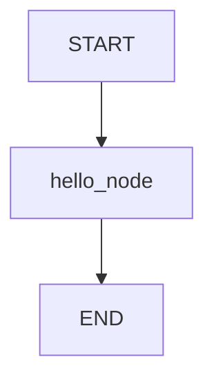

# Module 1: Hello Graph

## Start With Observation

Run the module first:

```bash
./lab module 1
```

Windows:

```powershell
.\lab.cmd module 1
```

Expected output:

```text
{'user_message': 'student', 'response': 'Hello, student. Welcome to LangGraph.'}
```

Before naming the concept, ask:

- What data went in?
- What changed?
- Which function probably made the change?

## Name The Concept

A graph is a workflow made from state, nodes, and edges.

## Flow



## Why This Module Is Inductive

Yes. Students can discover the rule by comparing the input and final state.
