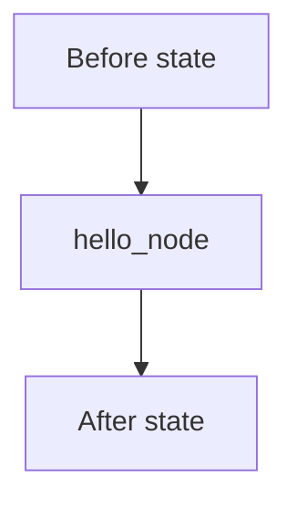

# Module 2: State Management

## Start With Observation

Run the module first:

```bash
./lab module 2
```

Windows:

```powershell
.\lab.cmd module 2
```

Expected output:

```text
Before: {'user_message': 'Ada'}
After: {'user_message': 'Ada', 'response': 'Hello, Ada. Welcome to LangGraph.'}
```

Before naming the concept, ask:

- What data went in?
- What changed?
- Which function probably made the change?

## Name The Concept

State is the shared data object that moves through the graph.

## Flow



## Why This Module Is Inductive

Yes. Students can infer state by seeing what changed between `Before` and `After`.
