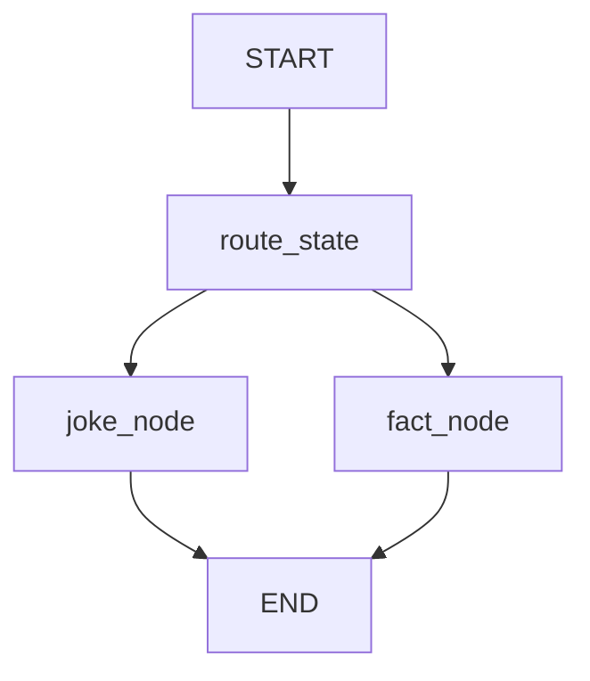

# Module 3: Conditional Edges

## Start With Observation

Run the module first:

```bash
./lab module 3
```

Windows:

```powershell
.\lab.cmd module 3
```

Expected output:

```text
{'user_message': 'Tell me a joke', 'response': 'A graph node walked into a bar and found the shortest path.', 'route': 'joke'}
{'user_message': 'Tell me a fact', 'response': 'Fact: LangGraph represents workflows as stateful graphs.', 'route': 'fact'}
```

Before naming the concept, ask:

- What data went in?
- What changed?
- Which function probably made the change?

## Name The Concept

Conditional edges choose the next node by inspecting state.

## Flow



## Why This Module Is Inductive

Yes. Ask students to predict the route, run the module, then compare prediction with output.
