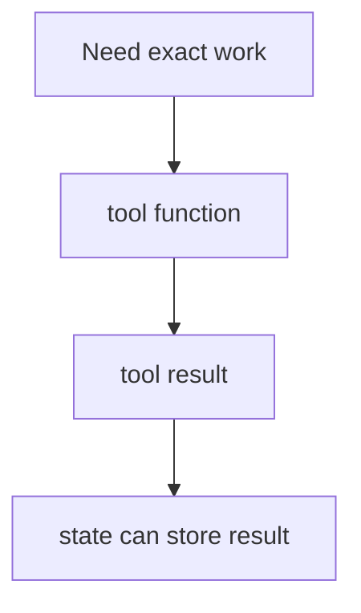

# Module 4: Tools

## Start With Observation

Run the module first:

```bash
./lab module 4
```

Windows:

```powershell
.\lab.cmd module 4
```

Expected output:

```text
x = 4
words=8; sentences=2; reading_time=1 min; keywords=langgraph, keeps, state
high-priority: primary-source signal, freshness signal
```

Before naming the concept, ask:

- What data went in?
- What changed?
- Which function probably made the change?

## Name The Concept

Tools are deterministic functions a workflow can call when it needs reliable work.

## Flow



## Why This Module Is Inductive

Yes. Students can see why tools are useful before hearing the formal definition.
