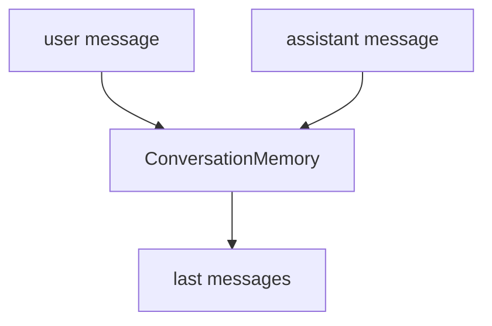

# Module 5: Memory

## Start With Observation

Run the module first:

```bash
./lab module 5
```

Windows:

```powershell
.\lab.cmd module 5
```

Expected output:

```text
['user: What is LangGraph?', 'assistant: A stateful graph framework.']
```

Before naming the concept, ask:

- What data went in?
- What changed?
- Which function probably made the change?

## Name The Concept

Memory stores context across turns so later steps can use earlier messages.

## Flow



## Why This Module Is Inductive

Yes. The stored message list makes memory visible immediately.
