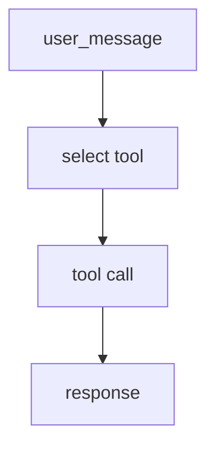

# Module 6: ReAct Agent

## Start With Observation

Run the module first:

```bash
./lab module 6
```

Windows:

```powershell
.\lab.cmd module 6
```

Expected output:

```text
{'user_message': 'solve an equation', 'tool_name': 'equation_solver_tool', 'tool_result': 'x = 4', 'response': 'x = 4'}
{'user_message': 'analyze this text', 'tool_name': 'text_analyzer_tool', ...}
{'user_message': 'triage this source', 'tool_name': 'source_triage_tool', ...}
```

Before naming the concept, ask:

- What data went in?
- What changed?
- Which function probably made the change?

## Name The Concept

An agent-style workflow chooses an action, observes the result, and returns an answer.

## Flow



## Why This Module Is Inductive

Partly. The output is observable, but the instructor should explain the reason-act-observe pattern.
