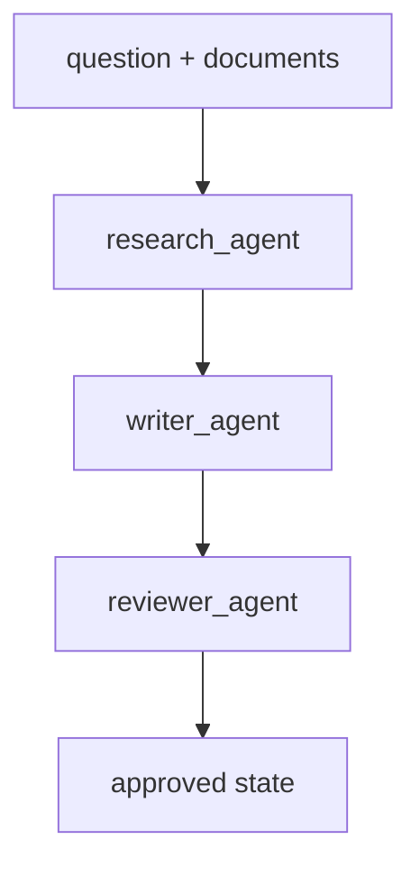

# Module 7: Multi-Agent

## Start With Observation

Run the module first:

```bash
./lab module 7
```

Windows:

```powershell
.\lab.cmd module 7
```

Expected output:

```text
{'question': 'What is LangGraph?', 'documents': ['LangGraph is a stateful graph framework.'], 'summary': ..., 'draft': ..., 'review': ..., 'approved': True}
```

Before naming the concept, ask:

- What data went in?
- What changed?
- Which function probably made the change?

## Name The Concept

A multi-agent workflow splits work into named roles with clear handoffs.

## Flow



## Why This Module Is Inductive

Partly. Students can observe the role handoffs, then the instructor should explain why role boundaries matter.
