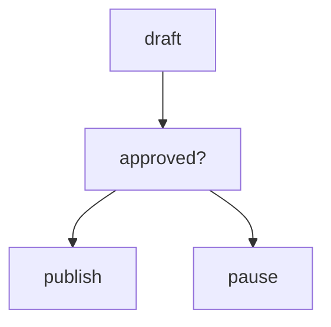

# Module 8: Human Review

## Start With Observation

Run the module first:

```bash
./lab module 8
```

Windows:

```powershell
.\lab.cmd module 8
```

Expected output:

```text
{'user_message': 'Draft answer', 'approved': True, 'response': 'Published: Draft answer'}
{'user_message': 'Draft answer', 'approved': False, 'response': 'Paused for human feedback.'}
```

Before naming the concept, ask:

- What data went in?
- What changed?
- Which function probably made the change?

## Name The Concept

Human-in-the-loop workflows pause automation before important actions.

## Flow



## Why This Module Is Inductive

Yes. The approval gate is concrete and easy to see in the output.
