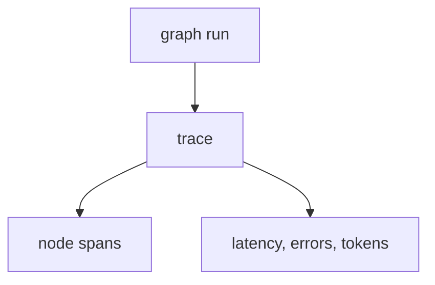

# Module 9: LangSmith

## Start With Observation

Run the module first:

```bash
./lab module 9
```

Windows:

```powershell
.\lab.cmd module 9
```

Expected output:

```text
{'tracing': False, 'project': 'langgraph-learning-lab'}
{'user_message': 'LangSmith learner', 'response': 'Hello, LangSmith learner. Welcome to LangGraph.'}
```

Before naming the concept, ask:

- What data went in?
- What changed?
- Which function probably made the change?

## Name The Concept

LangSmith shows what happened inside an AI workflow run.

## Flow



## Why This Module Is Inductive

Partly. Students can run the module, but traces and spans need a short instructor explanation.
