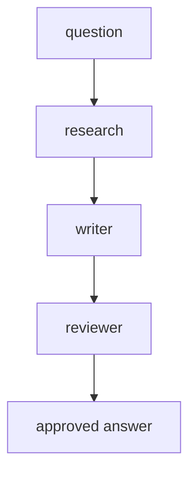

# Module 10: Capstone Project

## Start With Observation

Run the module first:

```bash
./lab capstone
```

Windows:

```powershell
.\lab.cmd capstone
```

Expected output:

```text
{'question': 'Why use LangGraph?', 'documents': [...], 'summary': ..., 'draft': ..., 'review': ..., 'approved': True}
```

Before naming the concept, ask:

- What data went in?
- What changed?
- Which function probably made the change?

## Name The Concept

The capstone combines state, roles, review, and final output into one research-assistant workflow.

## Flow



## Why This Module Is Inductive

Partly. Students can recognize earlier pieces, then the instructor should explain how composition creates a larger workflow.
